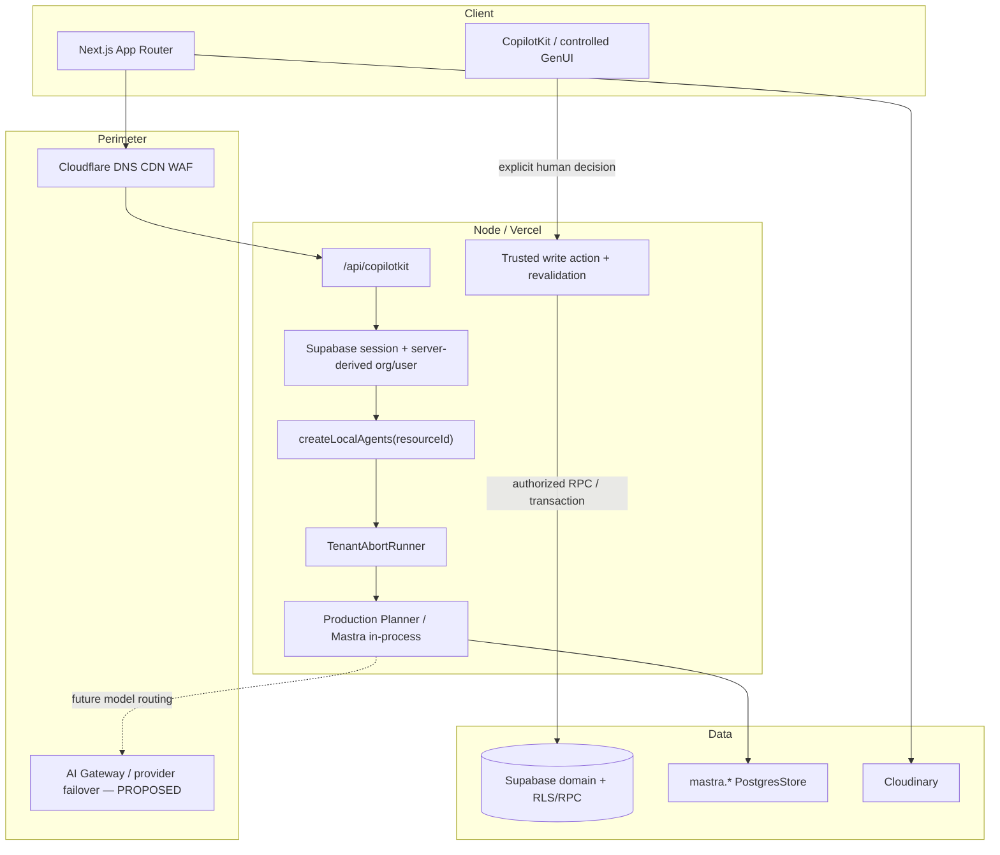

# iPix V2 — Product Requirements Document

**Status:** Master specification · Baseline V2
**Baseline date:** 2026-08-24
**Last product/runtime truth-sync:** 2026-09-28 — exact SHA, tests, CI, and review evidence live in Linear/GitHub rather than this long-lived PRD.
**Author:** iPix Core Architecture Team
**Repository:** [amoai-tech/ipixai](https://github.com/amoai-tech/ipixai) (`this repository`)
**This file is the product SSOT.** Other PRDs are companions or drafts.

| Document | Role |
|---|---|
| **This page** (`docs/prd.md`) | Product requirements master |
| **[Product sitemap](./sitemap.md)** | Product routes and phases (not HTML prototype counts) |
| **[Live execution board](https://linear.app/amo100/project/v2-ipix-cd2f90b58cd2/issues)** | Task status, blockers, ownership, and current execution |
| **[Documentation map](./docs-index.md)** | Current documentation map and source-of-truth routing |
| **[ADR 001](./adr/001-node-first.md)** | Start of the accepted architecture decision set |
| internal architecture annex (not published) | Long-form architecture annex |
| internal alternate draft (not published) | Alternate draft — **do not treat as SSOT** |
| historical migration/rebuild plans | Preserved in Git as evidence; not current architecture authority |

The numbered rebuild guides (`docs/01`–`14`) remain historical. This PRD is the V2 product SSOT.

---

## 1. Source of truth

This PRD is the durable **product-intent** contract, not a replacement for executable/runtime truth.

- **Product intent truth:** this PRD + the [product sitemap](./sitemap.md) + accepted ADRs listed by [`docs/adr/README.md`](./adr/README.md). Use these for product scope, journeys, invariants, phases, and accepted architectural decisions.
- **Implementation truth:** current clean `origin/main` → installed package types + lockfile → safely inspected runtime/Supabase/tests/CI → official version-specific vendor docs → other project markdown. When implementation evidence contradicts prose, implementation evidence wins until the product/ADR decision itself is intentionally changed.
- **Durable data truth:** Supabase/Postgres owns application records, tenancy, approvals, audit/provenance, and domain state within its defined schemas/contracts.
- **Execution truth:** the [live Linear board](https://linear.app/amo100/project/v2-ipix-cd2f90b58cd2/issues) owns task status, blockers, ownership, current evidence, and Done state.
- **Legacy:** `legacy lumina-studio checkout` and lumina-studio are reference for UX/domain logic only, never V2 runtime authority.

**Legacy policy:** Reuse proven business rules, schemas, prompts, and screen IA. Do not copy Worker/OpenNext, Hyperdrive, ALS, custom Copilot SSE shims, `MASTRA_STORAGE_MODE=noop`, `resourceId: "default"`, or combined `npm run dev`.

### 1.1 Requirement tags

| Tag | Meaning |
|---|---|
| `[IMPLEMENTED]` | Exists in the current implementation and is proven by code/tests; **does not by itself mean production-certified** |
| `[CERTIFIED]` | The exact artifact/SHA has passed the named runtime/environment proof and required user journey |
| `[REQUIRED]` | Must ship for the named phase |
| `[PROPOSED]` | Preferred direction that is not yet accepted as an ADR/current runtime contract |
| `[TARGET]` | Product KPI to measure; not a release gate until explicitly promoted |
| `[DEFERRED]` | Deliberately outside this phase |
| `[LEGACY]` | Reference only |

### 1.2 Stack truth (this repo)

**Today `[IMPLEMENTED]`:** Next.js App Router + CopilotKit v2 (`/api/copilotkit`) + AG-UI + Mastra are implemented. Runtime package pins belong only in [`docs/mastra/runtime-family.md`](mastra/runtime-family.md) and executable package metadata; this PRD deliberately does not copy them.

**Product runtime shape `[IMPLEMENTED]`:**

```text
authenticated /api/copilotkit request
  → requirePlannerResourceId(request)
  → createLocalAgents(resourceId)
  → TenantAbortRunner(resourceId, request.signal)
  → in-process Production Planner / Mastra tools + workflows
  → PostgresStore in private mastra.* for durable AI runtime state
  → Supabase/Postgres domain RPCs for authorized business truth
```

- **Hosted memory:** guarded `PostgresStore` in private `mastra.*` with `disableInit: true`; hosted mode fails closed when `MASTRA_DATABASE_URL` is missing or unapproved. When that URL is intentionally absent in local development, Mastra uses `InMemoryStore`; it is non-durable and must never be described as production persistence.
- **No env-switched remote Product runtime:** `MASTRA_BASE_URL`, managed Intelligence keys, and similar remote helpers do not choose the Production Planner path. A future remote topology requires its own accepted decision + certification.
- **Chat/UI runtime:** CopilotKit/AG-UI is the interactive surface; it is not business authority and it is not a custom Worker Copilot SSE shim.
- **Dev:** `npm run dev:ui` (port 3000) and `npm run dev:agent` (port 4111) run in separate terminals. `dev:agent` exists for standalone Mastra development/testing; the deployed Product `/api/copilotkit` route still uses the in-process path above. Combined `npm run dev` is blocked (**DEV-STAB-001**).
- **Media:** Cloudinary is the media layer. The server owns signing/webhook trust; the client never holds the API secret. Do not invent a second CDN pipeline.
- **Model routing:** the current Production Planner reads its configured model directly from `src/mastra/agents/production-planner.ts`. Cloudflare AI Gateway/failover is a `[PROPOSED]` future routing option, not a solid-line dependency of the current Product runtime.

## 2. Problem and solution

Fashion production runs on spreadsheets, email, and tools that do not know Brand DNA. Deals, shoots, casting, bookings, and assets are re-typed across silos.

**iPix V2** is an AI-native fashion production OS: a 3-panel operator workspace (nav, canvas, intelligence) plus in-process Mastra agents. AI drafts Brand DNA, deliverables, shot lists, 5-week DAG schedules, talent matches, booking offers, and CRM notes. **AI reads, computes, and proposes. Humans approve. Authenticated RPCs with the user JWT commit domain writes.**

### 2.1 Pillars

1. **Vercel + Node `[IMPLEMENTED]`** — ADR-001. CopilotKit/Mastra host is **Vercel**. Cloudflare = DNS/CDN/WAF (and optional AI Gateway later). **Workers are not the AI host** — **IPI-1121** is future.
2. **Supabase tenancy `[REQUIRED]`** — ADR-003. Org from membership, server-side. Fail closed. The CopilotKit route now derives operator/resource identity from the verified session; cross-org release certification remains a test requirement.
3. **Mastra memory vs domain `[IMPLEMENTED]`** — ADR-002. `mastra.*` is conversation/traces; `shoot.*` / `planner.*` / `talent.*` / `crm.*` are product truth.
4. **HITL writes `[REQUIRED]`** — AI proposes; the human reviews/edits and explicitly decides; trusted server/database code revalidates the exact approved artifact before any consequential write. No model/browser state grants write authority.

---

## 3. Vision, principles, KPIs

**Vision:** A brand-aware digital crew that cuts operational grind without taking creative or commercial control from humans. (80% overhead cut is a **hypothesis**, not an MVP gate.)

**Principles:** stream, don’t spinner · every recommendation cites evidence · AI drafts / humans decide · canvas and chat share state · missing org/user → 401/403.

These are **product outcome KPIs**. Security, integrity, audit, and E2E requirements live in §14 as release/acceptance gates instead of being mixed with business metrics.

| KPI | MVP target | Tag | How |
|---|---|---|---|
| Brand URL → approved DNA | < 10 min | `[TARGET]` | Telemetry submit → approve |
| Brief → reviewable 3-gate plan | < 5 min | `[TARGET]` | Telemetry |
| Manual planning steps cut | ≥ 60% | `[TARGET]` | vs legacy baseline |
| AI proposals accepted with no major rewrite | ≥ 70% | `[TARGET]` | approve / minor-edit vs reject |

## 4. Goals and non-goals

### Goals

| ID | Goal | Phase |
|---|---|---|
| G-1 | Brand DNA from a public URL in < 2 min active operator time | **MVP** |
| G-2 | One action instantiates an 11-phase 5-week shoot DAG | MVP |
| G-3 | Chat + working memory survive hard refresh **and** agent restart (`PostgresStore`) | **Core** |
| G-4 | Org B cannot read Org A threads, shoots, assets, or CRM | **Core** |
| G-5 | Mastra/CopilotKit decoupled from domain DB and Cloudinary | Core |
| G-6 | Reuse proven domain logic; rebuild only the runtime | All |
| G-7 | One authenticated operator workspace: `/app` shell + embedded Production Copilot; domain surfaces expand through MVP | Core→MVP |

### Non-goals

- Native iOS/Android (web ≥768px; phone after MVP).
- Two-way Google/Outlook calendar (read-only `.ics` only).
- In-house render farm / image generator (Cloudinary).
- Full PERT/CPM resource leveling (direct DAG links only).
- Custom storefront (Medusa/Mercur stays commerce).
- General-purpose shell agents, A2A/ACP, GraphRAG, extra vector DBs, observational memory in Core.
- Full WhatsApp automation, invoices/payments/contracts in Core.
- Cloudflare Workers as the CopilotKit/Mastra host (**IPI-1121**) — future only; current host is **Vercel**.
- Catalog / collections / PDP / events / `/app/model` / `/app/roster` in Core/MVP nav.

---

## 5. Personas and roles

| Persona | Role key | Phase | Needs |
|---|---|---|---|
| Executive / studio owner | `org_admin` | Core | Billing, team, final budget/contract |
| Senior producer | `producer` | Core | Timeline, call sheet, crew, budget variance |
| Creative director | `creative_director` | Core | Brand DNA, shot lists, asset QC |
| Sales / relationships | `sales_rep` | MVP | Pipeline, contacts, deal → shoot |
| External talent / crew | `collaborator` | Post-MVP | Call sheets, dates, uploads; **no** internals finance |

Planner four-tier ACL (`owner > manager > contributor > viewer`) remains `[PROPOSED]` until an ADR is actually created and accepted; do not pre-assign its ADR number here.

---

## 6. Journeys

1. **Brand DNA `[MVP]`** — URL → crawl/vision → `BrandDNACard` → Approve → `promote_brand_draft` RPC. Fail: manual intake + upload. Not Core (Core is persist + the `/app` Production Copilot only; IPI-1225 · PLANNER-ROUTE-RETIRE-001 retired `/planner` to a compatibility redirect).
2. **3-gate shoot `[MVP]`** — Deliverables → shot list → budget → `commit_shoot_draft` → `shoot.*` + `planner.instances`. **Not** Core.
3. **Production DAG `[MVP UI; schema Core-ready]`** — Topological shift on slip; cycle detection before write.
4. **Talent + booking `[MVP]`** — Separate routes: `/app/matching/talent/[id]/book` and `/app/bookings/[id]`. **Not** Shoot Wizard `flow=booking`.
5. **CRM `[MVP]`** — Companies / contacts / pipeline; won deal → ApprovalCard → Brand. Legacy React is real; still **not** Core.

**Failures `[REQUIRED]`:** crawl fail → manual intake; model/provider failure → explicit error + safe retry (provider failover only after separately implemented/certified); reject → edit/regenerate; concurrent edit → optimistic lock + diff; lost stream/reconnect → recover from durable thread/run state without duplicate side effects; double-click/retry → idempotent result.

---

## 7. Product sitemap (summary)

Canonical routes: **[Product sitemap](./sitemap.md)**.

| Phase | Authenticated surfaces |
|---|---|
| **Core** | `/login` (minimal) + **`/app`** — Operator Shell with the Production Copilot embedded (`/planner` is now a compatibility redirect only) |
| **MVP** | Shell + `/app`, `/app/brands`, `/app/shoots`, campaigns, assets, preview, matching/book, bookings, CRM, inbox, settings, `/onboarding` |
| **Post-MVP** | `/app/analytics`, `/app/plans/*` (legacy production workspace), talent self-serve |
| **Advanced** | Catalog, collections, PDP, events, collab graph |

This repo today already includes marketing/auth/onboarding pages, authenticated operator routes, brands, shoots, plans, the Planner, and API routes. HTML in `Universal-design-prompt-4/Pages/` remains design reference; route files and verified runtime behavior determine what is actually implemented.

---

## 8. Architecture



**Write path `[REQUIRED]`:** Browser session → trusted server-derived user/org → Mastra read/compute/propose → controlled GenUI → explicit human review/edit/decision → trusted server re-derives actor/tenant and reloads/revalidates the **exact artifact/revision/hash** → authorized idempotent RPC/transaction → domain row + audit/provenance → **durable readback** before the workflow/UI treats the action as complete. The UI/model never writes durable business truth merely because the user clicked Approve.

**Memory `[REQUIRED]`:** `resourceId` is built server-side as `org:{orgId}::user:{userId}` by the authenticated Planner contract. `mastra.*` is runtime/memory truth only; `disableInit: true` in hosted production and repository migrations own its DDL.

## 9. Agents and workflows (Mastra)

Current code registers **one Product agent** and two domain workflows. Planned role/capability names must not be mistaken for shipped agents.

| Kind | Capability | Status | May | Must not |
|---|---|---|---|---|
| Agent | `production-planner` (`default`) | `[IMPLEMENTED]` | Reason/synthesize, choose typed tools, authenticated reads/compute, propose ShootPlan | Treat model output as authorization; directly mutate domain truth |
| Workflow | `brand-intelligence` | `[IMPLEMENTED]` | Bounded crawl/analyze/draft flow | Promote approved Brand truth without the normal trusted approval/write path |
| Workflow | `shoot-plan-review` | `[IMPLEMENTED]` | Stage exact revision/hash, suspend, resume from durable decision proof | Resume from client decision payload alone |
| Capability / future agent | creative direction | `[PROPOSED]` MVP | DNA scoring, creative/brief draft | Publish autonomously |
| Capability / future agent | CRM assistant | `[PROPOSED]` MVP | Search and propose activity/stage | Move won/lost or write consequential state without approval |
| Capability / future agent | booking / model match | `[PROPOSED]` MVP | Rank, quote draft, offer draft | Confirm booking, pay, publish, or send contracts autonomously |

Prefer **few domain agents + many typed tools + workflows only where deterministic/durable control matters**.

## 10. Supabase `[REQUIRED]`

Existing iPix project — no greenfield DB.

- Schemas: `public`, `shoot`, `planner`, `talent`, `crm` vs private `mastra.*`.
- RLS on every exposed tenant table; membership/role checks are server/database-derived and fail closed.
- Canonical shoots: `shoot.shoots`. Freeze `public.shoots`.
- Types: use the repository-owned `npm run supabase:types` workflow; do not bypass its reset/generation contract with an ad-hoc raw command.
- Prefer `SECURITY INVOKER` (the Postgres default) for functions that do not need elevated privileges. If `SECURITY DEFINER` is genuinely required, use `set search_path = ''`, schema-qualify every relation/function, explicitly `REVOKE`/`GRANT` execute privileges, revalidate actor/tenant inside the trusted boundary, and cover both allow + deny cases.
- Local baseline dumps must **not** be pending on `db push --linked`. Do not grant extra domain privileges merely to make tests pass, and do not `TRUNCATE` tenant tables as a substitute for migrations.

Supabase security references: [RLS](https://supabase.com/docs/guides/database/postgres/row-level-security) · [Database functions](https://supabase.com/docs/guides/database/functions).

## 11. HITL, audit, observability and privacy `[REQUIRED]`

Agents **may:** authorized reads, deterministic compute, structured proposal/GenUI state, Mastra runtime memory, request approval.

Agents **must not:** create/confirm consequential domain records, publish, pay, sign budgets/contracts, move consequential CRM/booking state, send external communications, delete durable truth, or bypass human approval.

**Exact-artifact invariant:** AI proposes → human reviews/edits → human explicitly approves/rejects the **exact artifact/revision/hash** → trusted server/database revalidates actor, tenant, current revision/hash, status, concurrency and idempotency → authorized idempotent write executes → **durable readback** is recorded/verified before continuation. Resume/UI payloads are intent, never durable approval authority.

Every consequential approval/commit records enough durable identity to reconstruct what happened: actor/user, org/tenant, action type, target, timestamp, proposal/artifact locator, revision/hash when applicable, idempotency/request identity, and resulting durable record/status.

**Observability/privacy:** Sentry/application logs and Mastra traces/evals are **operational evidence**, never business truth or approval authority. By default, do not capture raw prompts/model outputs, auth headers, cookies, access/session tokens, passwords, API keys, private keys, database connection strings, or sensitive personal data. Minimize/redact/pseudonymize where diagnostic context is required and keep domain audit/provenance separate from telemetry. See the [OWASP Logging Cheat Sheet](https://cheatsheetseries.owasp.org/cheatsheets/Logging_Cheat_Sheet.html).

## 12. Accessibility `[REQUIRED]`

Target **WCAG 2.2 AA**. Full keyboard operation; semantic landmarks; appropriate live-region behavior for streaming updates; visible/unobscured focus; non-drag alternatives where dragging is offered; and AA-compliant target sizing/spacing. Breakpoints: 3-panel ≥1440; collapsible intel 1024–1439; tablet 768–1023; **<768 deferred**. Skeletons match card layout; no blank flashes. Reference: [W3C WCAG 2.2](https://www.w3.org/TR/WCAG22/).

## 13. Phases (must match sitemap)

**Dependency:** Supabase/auth hardening → durable Mastra/Postgres memory → authenticated **`/app` Operator Shell + in-process Production Copilot** Core proof → Brand/Shoots → Wizard/CRM/Booking/media.

| Phase | Name | In | Out |
|---|---|---|---|
| 0 / Core | Secure durable Production Copilot | Minimal `/app` Operator Shell, server-derived identity, in-process Planner, durable `PostgresStore`, persistence/restart proof, Org B denial, exact-run Stop/recovery | Brand/Shoot domain workflows, CRM, booking writes |
| 1 / MVP spine | Shell + Brand + Shoots | Product nav/intel context, Brand, Shoots list/detail, Copilot collaboration | Legacy Worker/chat-dock copy-paste |
| 2 / MVP complete | Wizard + CRM + booking + media | 3-gate wizard, Brand crawl, CRM, matching + booking routes, Cloudinary signed upload | `/app/plans` full production workspace, two-sided talent |
| 3 / Post-MVP | Plans workspace + analytics + talent | `/app/plans`, analytics honesty, availability, role dashboards | Separate/Worker AI host unless independently adopted and certified |

## 14. Acceptance criteria

| ID | Criterion | Phase |
|---|---|---|
| AC-01 | `TEST-PERSIST-UUID` survives refresh **and** agent/process restart from durable `mastra` messages | Core |
| AC-02 | Org B + Org A `threadId` → **403** with a JSON error envelope and **no thread/message content** | Core |
| AC-03 | Brand URL → DNA card < 120s; no domain write until explicit approval | MVP |
| AC-04 | 3-gate commit writes the exact approved rows/artifact into `shoot.*` + `planner.instances` < 1.5s | MVP |
| AC-05 | +3 business days on predecessor shifts successors < 15ms; no cycles | MVP |
| AC-06 | **Domain mutations audited: 100%** for actions designated consequential | Core+ |
| AC-07 | **Duplicate domain commits: 0**; double-click/retry with the same approved request yields one durable result | Core+ |
| AC-08 | Stop terminates the **requested active run**, the composer returns to Send, and reconnect/reload cannot double-resume or duplicate output | Core |
| AC-09 | **Cross-tenant leakage: 0** across thread/message and tenant-owned domain reads/writes | Core+ |
| AC-10 | HITL commit/recovery binds the current exact artifact/revision/hash and performs durable readback before continuation | Core+ |
| AC-11 | **Critical journeys E2E green: 100%** for the release's declared critical-journey set | Release |
| AC-12 | Telemetry/logging respects §11 privacy exclusions; no secret/auth/session material is required for normal diagnostics | Core+ |

## 15. Test strategy `[REQUIRED]`

Use the cheapest decisive proof first; proof classes remain independent.

| Layer | Scope | Gate |
|---|---|---|
| Static / contract | Doc/runtime invariants, schemas, types, policy ownership | Every relevant change |
| Unit / tool | Budget math, DAG cycles, Zod, agent/tool gates, fail-closed auth helpers | PR when touched |
| pgTAP / SQL / RLS / RPC | Tenant isolation, function grants, allow+deny behavior, idempotency/concurrency | Migration/security PRs |
| Stream / runtime | CopilotKit/AG-UI event shape, persistence/recovery, exact-run Stop | Runtime changes |
| Browser / E2E | Critical user journey, HITL exact-artifact flow, tenant boundary | Risk-scoped PR/release gate |
| Preview / production | Exact deployed SHA + real journey + operational readback | Required before `[CERTIFIED]` claim |

Do not claim production-ready or `[CERTIFIED]` from unit/build evidence alone. Record the exact verification level/artifact/environment in Linear/PR evidence.

## 16. ADRs

**Accepted ADRs:** the canonical inventory is [`docs/adr/README.md`](./adr/README.md). Do not duplicate its numbered list here; the next identifier is assigned only when an ADR file is actually created.

### Candidate ADR topics (unnumbered until created)

| Candidate topic | Why an ADR may be needed |
|---|---|
| Cloudinary as sole image/video transform + delivery provider | Lock media ownership and Postgres/provider identity boundary |
| Consequential HITL write gate | Formalize the exact-artifact/revalidation invariant in §11 |
| Workflow policy | Define when durable/static Mastra workflows are required vs direct tools/agents |
| Planner four-tier ACL | Formalize `owner > manager > contributor > viewer` semantics |
| Canonical `shoot.shoots` ownership | Lock canonical shoot-table ownership and legacy freeze |
| Model gateway/failover routing | Adopt Cloudflare AI Gateway or another router only with measured need + certification |

## 17. Risks

| ID | Risk | Sev | Mitigation |
|---|---|---|---|
| R-01 | CopilotKit/Mastra independent bump | P0 | ADR-004 + contract tests |
| R-02 | Wrong `resourceId` leaks threads | P0 | Server helper + 403 E2E |
| R-03 | `anon` EXECUTE on DEFINER RPCs | P1 | REVOKE/GRANT audit |
| R-04 | Mastra snapshot bloat | P1 | Retention job |
| R-05 | Code hits `public.shoots` | P1 | Freeze + types on `shoot.*` |
| R-06 | Model/provider outage or rate limits | P2 | Explicit failure/retry; provider failover only after separately implemented + certified |
| R-07 | Cyclic planner DAG | P2 | `detectCycles` before shift |
| R-08 | Stream disconnect / cancellation recovery | P2 | Durable state + exact-run Stop + state-aware resume; prove no duplicate continuation |
| R-09 | Unsigned Cloudinary uploads | P2 | Server-signed, short-lived |
| R-10 | Combined `npm run dev` | P2 | Keep script blocked |

---

## 18. Open decisions

1. Global Intelligence panel vs `/app/intelligence` page — **keep panel for MVP**.
2. Model routing — **current Product Planner uses its source-configured provider/model directly; Gateway/failover remains a candidate until separately adopted and certified**.
3. Observational memory — **Phase 3**.
4. Brand vs CRM company naming — **keep both** (DNA vs relationship).

---

## 19. Linear workstreams (execution truth stays in Linear)

Do not copy task IDs/status into this long-lived PRD. The [live execution board](https://linear.app/amo100/project/v2-ipix-cd2f90b58cd2/issues) owns current issue identifiers, blockers, owners, evidence, and Done state.

| Workstream | Stable outcome owned by that stream |
|---|---|
| Persistence | Durable Planner memory/run state with restart/recovery proof |
| Auth / tenancy | Server-derived identity + RLS/RPC isolation + cross-tenant denial |
| Planner runtime | Production Planner reasoning/tools, exact Stop/recovery, runtime certification |
| Operator UX | `/app` shell + CopilotKit/GenUI proposal/review experience |
| Brand / Shoot | Brand intelligence, ShootPlan, DAG and asset flows |
| CRM / Booking | Relationship + booking drafts with explicit consequential-write approval |
| Media / publishing | Cloudinary-governed asset workflow and later approved publishing |
| Analytics / learning | Honest metrics, provenance and measured feedback loops |

## 20. Legacy → V2

| Artifact | Decision | Phase |
|---|---|---|
| Zeely tokens + 3-panel shell | KEEP / COPY+CLEAN | MVP (not Core) |
| Planner prompts + 3-gate rules | PORT | Core/MVP |
| Pure shoot compute libs | PORT | Core |
| Shoot wizard workflow | REWRITE on static Mastra | MVP |
| Brand crawl | REWRITE; bounded payloads + RPC | MVP |
| CRM workspaces + tests | PORT | MVP |
| `planner.*` engine | KEEP schema; Hub UI later as `/app/plans` | Post-MVP |
| Legacy Worker/OpenNext/ALS/custom remote Copilot transport glue | DROP | — |
| `public.shoots` | FREEZE | Core |
| HTML `Pages/*.dc.html` | REFERENCE only | — |

Reuse ~domain/UI; drop ~runtime glue. Do not rebuild 40 screens from blank.

---

## 21. Readiness

- **Product-intent SSOT:** this PRD + `sitemap.md` + accepted ADR inventory; implementation/runtime evidence still outranks stale prose.
- **Core certification gate:** persistence/restart + tenant isolation + exact-run Stop/recovery + privacy/security acceptance criteria must pass for the exact deployed artifact before a `[CERTIFIED]` claim.
- **Do not** `supabase db push --linked` with un-ledgered baseline dumps.
- Companion PRDs that treat HTML prototypes as shipped product (“31 screens built”) or prescribe a custom Worker/remote Copilot runtime are **stale** relative to the current Product path.
